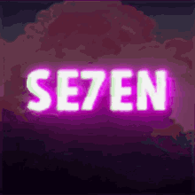

<!--
### Hi every 👋
-->
<!--
**razor262/razor262** is a ✨ _special_ ✨ repository because its `README.md` (this file) appears on your GitHub profile.

Here are some ideas to get you started:-->

- 🔭 I’m currently working in marketing
- 🌱 I’m currently learning JavaScript and English language
- 👯 I’m looking to collaborate on teams software engineer
- 🤔 I’m looking for help with Stack Overflow

<!--
- 💬 Ask me about 24.work@bk.ru
-->
<!--
 
-->

  
<!--
 -->
<!--
- 📫 How to reach me: 24.work@bk.ru-->
<!--
- 😄 Pronouns: ...
- ⚡ Fun fact: ...
-->

<h2 align="center">My skills:</h2>

 
